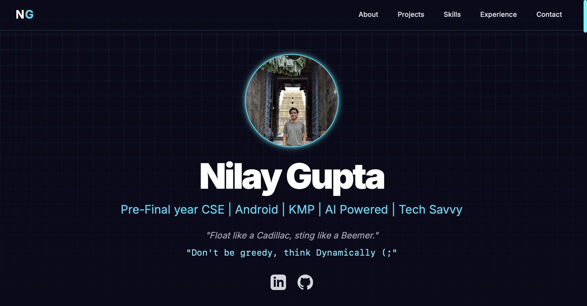

# Nilay Gupta's Portfolio Website

Welcome to the official repository for my personal portfolio website. This site is a showcase of my skills, projects, and professional journey.

**Visit the live site: [nilayg26.github.io](https://nilayg26.github.io/)**

---

### Screenshot

 
---

## About This Project

This portfolio was designed to be a dynamic and engaging introduction to my work for recruiters, collaborators, and fellow developers. It's built with a modern, cyberpunk-inspired aesthetic to reflect my passion for cutting-edge technology, while maintaining a clean and professional structure. The entire site is a single, responsive page, ensuring a seamless experience across all devices.

## Key Features

-   **Fully Responsive:** The layout adapts perfectly to desktops, tablets, and mobile phones.
-   **Interactive Skills Terminal:** An animated "hacker terminal" types out my technical skills for a unique visual experience.
-   **Smooth Scrolling & Animations:** Subtle fade-in animations and smooth navigation provide a polished user experience.
-   **Project Showcase:** A dedicated section to highlight my key projects with descriptions and links.
-   **Direct Resume Download:** A convenient "Download Resume" button in the contact section.

## Tech Stack

This project was built from the ground up using modern web technologies:

-   **HTML5:** For the core structure and content.
-   **Tailwind CSS:** For a utility-first, responsive, and highly customizable design.
-   **JavaScript (ES6+):** To power the interactive elements like the mobile menu and the skills terminal animation.

---
## Try Yourself!
[Click to launch Website!](https://nilayg26.github.io)

---

## Contact

Feel free to reach out!

-   **LinkedIn:** [@nilayg26](https://www.linkedin.com/in/nilayg26/)
-   **GitHub:** [@nilayg26](https://github.com/nilayg26)